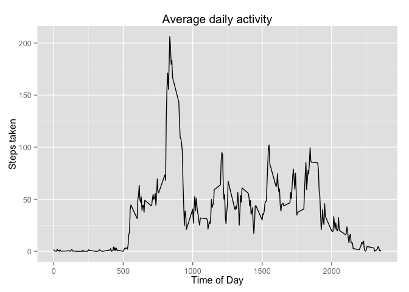

# Reproducible Research: Peer Assessment 1


## Loading and preprocessing the data

This chunk loads all libraries needed for the rest of the output.  I actually wanted to hide it, but couldn't figure out an elegant way to do so.


```r
library(dplyr)
```

```
## 
## Attaching package: 'dplyr'
## 
## The following objects are masked from 'package:stats':
## 
##     filter, lag
## 
## The following objects are masked from 'package:base':
## 
##     intersect, setdiff, setequal, union
```

```r
library(ggplot2)
library(lubridate)
```

This portion of the code downloads the data from cloudfront and loads it into a tbl_df called "activity".


```r
temp <- tempfile()
download.file("https://d396qusza40orc.cloudfront.net/repdata%2Fdata%2Factivity.zip", temp, "curl")
data <- read.csv(unz(temp, "activity.csv"))
unlink(temp)
activity <- tbl_df(data)
```

## What is mean total number of steps taken per day?

I generated a frequency histogram with this code.  I used dplyr, grouping here by date and then summing for all intervals in a given day.  

```r
activity_byDay <- group_by(activity, date)
activity_byDay <- filter(activity_byDay, !is.na(steps))
hist(summarise(activity_byDay, sum(steps))$"sum(steps)", breaks=10, col="green", main="Frequency of steps per day", xlab="Number of steps in day")
```

 

To determine the mean and median number of steps per day, I used the above-generated calculations of daily steps taken, and this code.

```r
mean <- mean(summarise(activity_byDay, sum(steps))$"sum(steps")
median <- median(summarise(activity_byDay, sum(steps))$"sum(steps")
```

I found that the median number of steps taken per day was 10765, and the mean was 1.0766189\times 10^{4}.

## What is the average daily activity pattern?

Averaging over the provided data yields this plot.


```r
activity_byInterval <- group_by(activity, interval)
activity_byInterval <- filter(activity_byInterval, !is.na(steps))
sumrdDta <- summarise(activity_byInterval, mean(steps))
qplot(sumrdDta$interval, sumrdDta$"mean(steps)", geom="line", main="Average daily activity", xlab="Time of Day", ylab="Steps taken")
```

 

Finding the interval that is, on average, most active is easily accomplished wiht the "which.max" function.

```r
sumrdDta[which.max(sumrdDta$"mean(steps"),]
```

```
## Source: local data frame [1 x 2]
## 
##     interval mean(steps)
## 104      835    206.1698
```

Here, that interval is 835 (8:35 AM).

## Imputing missing values

I create a new data frame identical to "activity."  I then populate the NA values with the average number of steps during that interval calculated in the previous section.


```r
imputed <- cbind(activity)
for (i in 1:nrow(imputed)) {if (is.na(imputed[i, "steps"])) {imputed[i, "steps"] <- filter(sumrdDta, interval == imputed[i, "interval"])$"mean(steps)"}}
```


```r
imputed_byInterval <- group_by(imputed, interval)
imputed_byDate <- group_by(imputed, date)

hist(summarise(imputed_byDate, sum(steps))$"sum(steps)", breaks=10, col="red", main="Frequency of steps per day (with imputed information)", xlab="Number of steps in day")
```

 


```r
imputed_mean <- mean(summarize(imputed_byDate, sum(steps))$"sum(steps)")
imputed_median <- median(summarize(imputed_byDate, sum(steps))$"sum(steps)")
```

The mean value is 1.0766189\times 10^{4}, while the median is 1.0766189\times 10^{4}.

## Are there differences in activity patterns between weekdays and weekends?

Physical activity is generally more spreadout throughout the typical weekend day.


```r
imputed <- mutate(imputed, weekdays(ymd(imputed$date)))

weekdays <- filter(imputed, weekdays(ymd(imputed$date)) %in% c("Monday", "Tuesday", "Wednesday", "Thursday", "Friday"))
weekends <- filter(imputed, weekdays(ymd(imputed$date)) %in% c("Saturday", "Sunday"))

weekdays <- group_by(weekdays, interval)
mn_stps_wkdays <- summarize(weekdays, mean(steps))
weekends <- group_by(weekends, interval)
mn_stps_wknds <- summarize(weekends, mean(steps))

qplot(mn_stps_wkdays$interval, mn_stps_wkdays$"mean(steps)", main="Average daily activity (weekdays)", xlab="Time of Day", ylab="Steps tracked.")
```

 

```r
qplot(mn_stps_wknds$interval, mn_stps_wknds$"mean(steps)", main="Average daily activity (weekends)", xlab="Time of Day", ylab="Steps tracked.")
```

 
